# rserve-proxy

Rserve proxy for running and managing Rserve instances on a VPS.

## Architecture

The system is deployed as a Docker Compose stack:

```mermaid
graph TD
    Internet((Internet)) --> Traefik

    subgraph compose["Docker Compose Stack"]
        Traefik["🔀 Traefik\n:443 / :80\nauto-discovers containers\nvia Docker labels"]
        Manager["🖥️ Manager\nFastify API + React UI"]
        Postgres[("🗄️ PostgreSQL\nusers, tokens,\napp configs")]

        subgraph spawner["Spawner Module (self-contained)"]
            SpawnerCore["builds app Docker images\nstarts/stops Rserve containers\nhealth checks\nmanages via Docker API"]
        end

        Manager --- spawner
        Manager --> Postgres
    end

    Traefik -- "/app1" --> App1
    Traefik -- "/app2" --> App2
    Traefik -- "/*" --> Manager

    subgraph instances["Dynamically Spawned Rserve Containers"]
        App1["📦 rserve-app1\nR 4.4 + packages"]
        App2["📦 rserve-app2\nR 4.3 + packages"]
    end

    spawner -. "create/start/stop\n(via dockerode)" .-> instances
```



### Services

1. **traefik** — Reverse proxy. Auto-discovers Rserve containers via Docker labels
   and routes incoming requests (e.g., `/app1`, `/app2`) to the correct instance.
   Handles TLS termination via Let's Encrypt.

2. **manager** — Fastify API + Vite/React SPA. Handles authentication (session
   cookies for UI, bearer tokens for API), health checks, and instance lifecycle.
   Contains the **spawner** module (see below). Serves the React UI as static files.

3. **postgres** — Stores users, hashed passwords, API tokens, app configurations,
   and audit logs.

4. **rserve-\*** — Dynamically spawned Docker containers, one per app. Each has a
   custom-built Docker image with a user-selected R version, installed packages, and
   the app's R code (cloned from git or uploaded via UI/API).

### Spawner Module

> **Design principle:** The spawner is a self-contained module within the manager
> responsible for all Rserve container lifecycle operations (build image, start, stop,
> restart, health check, status). It communicates with Docker via
> [dockerode](https://github.com/apocas/dockerode) and has **no dependencies on the
> web UI, auth, or Traefik layers**.
>
> This is intentional. While the spawner currently runs in-process within the manager,
> it is designed to be **extractable into a standalone service** in the future (e.g.,
> for pluggable backends like Kubernetes pod spawning, following the pattern established
> by [JupyterHub's Spawner architecture](https://jupyterhub.readthedocs.io/en/stable/reference/spawners.html)).
>
> **Rules for contributing to the spawner:**
> - The spawner must not import from or depend on the web UI, auth, or HTTP layers.
> - All communication with the spawner must go through its public interface.
> - The spawner manages its own state about running instances.
> - The manager calls the spawner; the spawner never calls back into the manager.

### Request Flow


### Management Flow


### Tech Stack

| Component | Technology |
|-----------|-----------|
| Language | TypeScript |
| API | Fastify |
| Frontend | Vite + React |
| Database | PostgreSQL (via Drizzle ORM) |
| Reverse Proxy | Traefik (Docker provider, label-based) |
| Container Management | dockerode |
| Package Manager | Bun (workspaces) |
| Production Runtime | Node.js |
| Rserve Images | Custom-built per app from `rserve-base:{R_VERSION}` |

### Project Structure

```
rserve-proxy/
├── docker-compose.yml          # Traefik + manager + Postgres
├── package.json                # Bun workspaces root
├── packages/
│   ├── api/                    # Fastify backend + spawner module
│   │   └── src/
│   │       ├── spawner/        # Self-contained, extractable
│   │       ├── routes/
│   │       ├── auth/
│   │       └── index.ts
│   ├── ui/                     # Vite + React SPA
│   │   └── src/
│   └── shared/                 # Shared types and interfaces
│       └── src/
├── images/
│   └── rserve-base/            # Dockerfile for base R + Rserve image
└── README.md
```

## Development

```bash
bun install          # Install all workspace dependencies
bun run dev          # Start API + UI in development mode
```

## License

MIT
